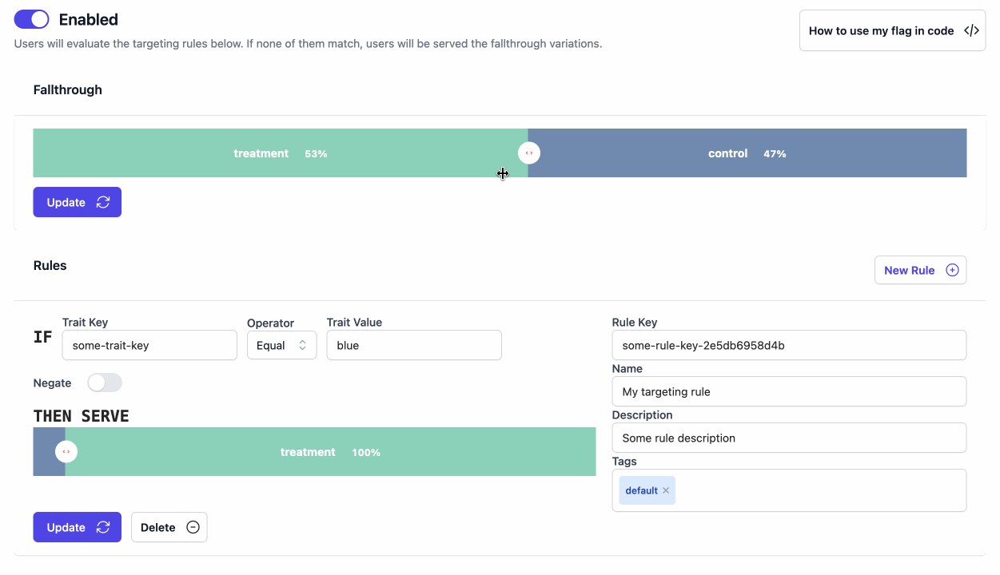
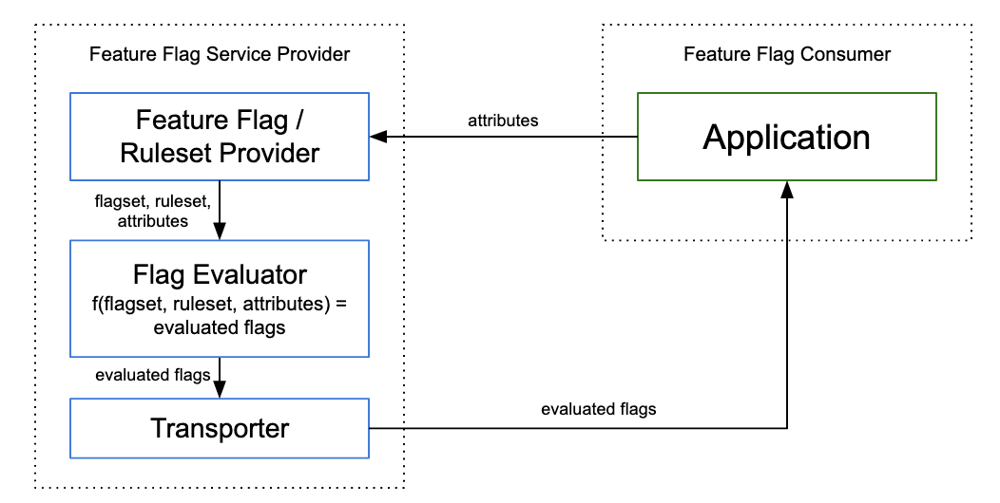
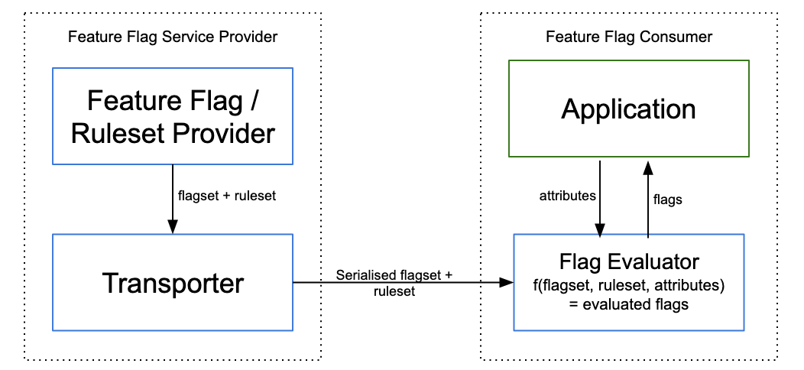
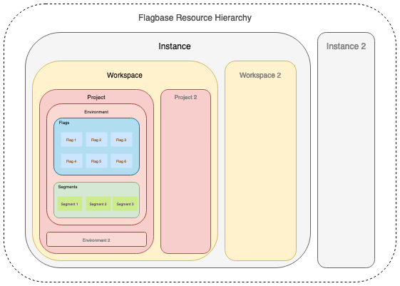

# **[Flagbase](https://flagbase.com)**: Democratizing Feature Management

[Flagbase](https://flagbase.com) is an open-source feature management platform, allowing you to manage, track and deliver feature flags to all your applications, in real-time. Flagbase was built with performance in mind, whilst being simple to use.

Flagbase offers these three key features:

- Workspace / Projects / Environments
- Feature Flags / Advanced Targeting
- Segments for reusable targeting
- Custom IAM roles and policies

Integrating Flagbase in your application is super simple. Get started by following our **[Quick Start Guide](https://flagbase.com/docs/guides/quick-start)** today!

## Features

Whilst Flagbase is quite minimal at its core - its extendable nature allows you to tailor it your organisation's needs.

Below are some of the features Flagbase offers:

### Intuitive Targeting

Flagbase uses a percentage-based targeting system by default - allowing you to incrementally release you feature to a particular segment of your users over time.

### Client and Server SDKs

Flagbase offers client-side and server-side SDKs for feature flagging. Client-side SDKs, embedded in client applications, personalize features for end-users but may have slower performance. Server-side SDKs handle server-to-server communication, maintain security, and are designed for high traffic and scalability.

|                     Client SDK                      |                     Server SDK                      |
| :-------------------------------------------------: | :-------------------------------------------------: |
|  |  |

### Well-designed Resource Hierarchy

Flagbase's resource hierarchy consists of instances, access, workspaces, projects, environments, flags, identities, segments, and targeting. An instance is a single Flagbase core installation using a shared PostgreSQL database. Access refers to key/secret pairs restricting operations on resources. Workspaces group projects, while projects contain flags and segments across multiple environments. Environments represent different targeting states. Flags determine feature states, while identities are flag observer/consumers. Segments group users based on traits, and targeting rules map conditions to flag variations within specific environments.

### Other Features

- Multiple transports (HTTP long-polling, SSE)
- Robust Identity & Access Management (IAM) that uses a hybrid RBAC/ABAC design policy based access control
- Extend to use additional contextual data from flag evaluations, using your own data sources
- Self hosted: can be provisioned to the cloud of your choice or run on-prem

## Getting started

Flagbase is very easy to get up and running. Follow our [quick start guide](https://flagbase.com/docs/guides/quick-start) to get up an running:

1. [Set up the core](https://flagbase.com/docs/core/setup): provision the service on server(s). You can use your preferred cloud vendor.
2. [Integrate to your application](https://flagbase.com/docs/sdk/overview): use the SDK in your application to wrap features you want to control remotely.
3. [Configure targeting](https://flagbase.com/docs/guides/targeting): set up your flag's targeting rules so users see feature variations intended for them.

That's it! Now your ready to release your feature code - knowing that you'll be able to turn it off anytime 🚀

## Directories

This [monorepo](https://en.wikipedia.org/wiki/Monorepo) contains the code for Flagbase Core, UI & SDKs.

- **[`/core`](./core/README.md)**: Code for `flagbased`, the service used to manage protected resources and stream feature flags to the SDKs. This service can be run in multiple worker modes, including `poller`, `streamer` and `API`.
- **[`/sdk`](./sdk/README.md)**: SDKs retrieve and evaluate feature flags from the service.
- **[`/ui`](./ui/README.md)**: UI interacts with the [Core API](https://flagbase.com/docs/api). It is used to manage resources (e.g. workspaces, projects, environments, flags, etc).
- **[`/website`](./website/README.md)**: Code for [flagbase.com](https://flagbase.com), build using [Docusaurus](https://docusaurus.io/).

## Support

Please [raise an issue](https://github.com/flagbase/flagbase/issues) and label it with `help wanted` or `question` for any help.

## Contributing

We encourage community contributions via pull requests. Before opening up a PR, please read our [contributor guidelines](https://flagbase.com/dev/intro/workflow#contributing).

Join us on [Github Discussions](https://github.com/flagbase/flagbase/discussions).

- [Announcements](https://github.com/flagbase/flagbase/discussions/categories/announcements): General PSAs & feature updates
- [Development](https://github.com/flagbase/flagbase/discussions/categories/dev): Where contributors discuss ideas
- [Help](https://github.com/flagbase/flagbase/discussions/categories/help): Stuck on something? Ask for help here 😄

## Roadmap

Flagbase's roadmap consists of our step-by-step plan made up of different parts:

- [Roadmap](https://roadmap.flagbase.com/)
  - [Goals](https://roadmap.flagbase.com/goals): big things we want to achieve
  - [Objectives](https://roadmap.flagbase.com/objectives): smaller goals that help reach the big ones
  - [Tasks](https://roadmap.flagbase.com/tasks): to-do items that explain what needs to be done to meet each objective

## Other Resources

- [Architecture](https://flagbase.com/dev/core/architecture)
- [Data models](https://flagbase.com/dev/core/data-models)

## License

Mozilla Public License Version 2.0, see [LICENSE](./LICENSE)
